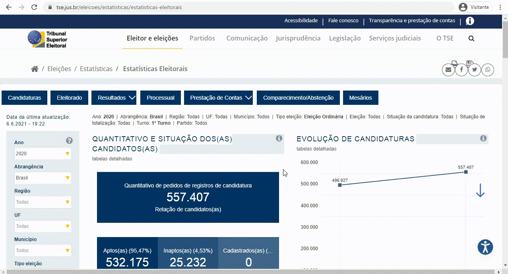
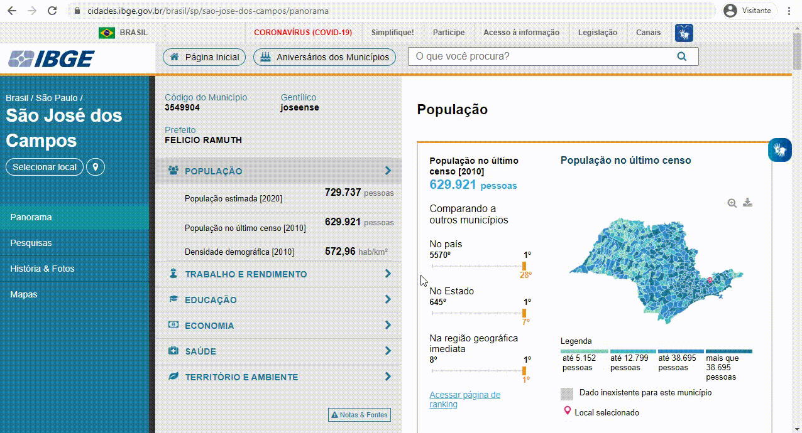

<a name="index"></a>
<h1 align="center">Análise de Dados Eleitorais</h1>
______________________________________________________________________________________________________________________________

# 1 - Introdução e Objetivo do Projeto

Este notebook tem objetivo de proporcionar um ambiente de análise de dados eleitorais.

## 1.1 - Objetivo das análises
* 01 - Mostrar a classificação do eleitorado a partir do estado civil, escolaridade e faixa etária, além da quantidade de eleitores que utilizam nome social;


* 02 - Relacionar as características do eleitorado de acordo com o representante eleito em determinada região;


* 03- Mostrar a renda média do eleitorado de determinada região;


* 04 - Mostrar, daquela região, a cidade com mais eleitores jovem e mais eleitores idosos;


* 05 - Comparar a renda média de eleitores do Vale do Paraíba com a de outras regiões do Estado;


* 06 - Automatizar a exportação das estatísticas;


* 07 - Relacionar características do eleitorado de acordo com o representante eleito em determinada região de eleições futuras;


* 08 - Mostrar a percentagem de eleitores ausentes da última eleição;


* 09 - Mostrar a evolução do número de eleitores;


* 10 - Análise de dados feita em Jupyter Notebook.

## 1.2 - Os dados

Os dados foram tirados de CSV's públicos, disponibilizados pelo TSE e IBGE, onde as fontes podem ser conferidas pelos links abaixo:

- [TSE - Tribunal Superior Eleitoral](https://www.tse.jus.br/eleicoes/estatisticas/repositorio-de-dados-eleitorais-1/repositorio-de-dados-eleitorais): Características do eleitorado e dos candidatos eleitos.
- [IBGE - Instituto Brasileiro de Geografia e Estatística](https://cidades.ibge.gov.br/brasil/sp/sao-jose-dos-campos/pesquisa/19/29765?localidade1=355410&localidade2=355030): Dados sobre renda da população

A partir destes links, para baixar os dados, siga os seguintes tutoriais:

### Bases de dados do TSE

Com este tutorial, é possível baixar os dados referentes aos candidatos, eleitorado e prestação de contas dos candidatos, onde este último não se encontra neste repositório devido ao seu tamanho que ultrapassa os limites que o GitHub suporta, logo, mesmo para uma primeira vez manipulando o notebook, é ideal baixar este CSV seguindo o passo a passo abaixo.

<div align="center">
  
</div>

<br>

### Bases de dados do TSE (Evolução dos eleitores)

Apesar dessas bases de dados ainda pertencerem ao TSE, estão em outro link, acessível [clicando aqui](http://www.tse.jus.br/eleicoes/estatisticas/estatisticas-eleitorais). Por conta disso, se fez necessário um tutorial específico para a captação destes CSVs.

<div align="center">
  
</div>

<br>

### Bases de dados do IBGE

Aplicamos a base de dados do IBGE na análise que diz respeito à renda dos eleitores, onde é preciso navegar por uma interface até que seja possível fazer o download dos dados, como o mostrado abaixo.

<div align="center">
  
</div>

<br>

### **Tutoriais retirados de: https://github.com/Equipe-01-DSM-2021/projeto-integrador-2021-1**

<a name="dev"></a>

# 2 - Preparativos
[Back to the top](#index)

Instale as dependências deste projeto através do comando:

`pip install -r requirements.txt`


# 3 - Getting started
[Back to the top](#index)

## 3.1 Configuração: Região de Estudo

### 3.1.1 Macroregiões

Para orientar-se por macrorregiões é possível escolher um município ou uma lista de municípios. Para o exemplo iremos colocar as regiões do Vale do Paraíba, Vale Histórico, Litoral Norte, Serra da Mantiqueira e Região Brangantina:

``` python
macro_regiao = {
    "VALE DO PARAÍBA": [
        "APARECIDA",
        "CAÇAPAVA",
        "CACHOEIRA PAULISTA",
        "CANAS",
        "CUNHA",
        "GUARATINGUETÁ",
        "IGARATÁ",
        "JACAREÍ",
        "JAMBEIRO",
        "LAGOINHA",
        "LORENA",
        "NATIVIDADE DA SERRA",
        "PARAIBUNA",
        "PINDAMONHANGABA",
        "PIQUETE",
        "POTIM",
        "REDENÇÃO DA SERRA",
        "ROSEIRA",
        "SANTA BRANCA",
        "SÃO JOSÉ DOS CAMPOS",
        "SÃO LUÍS DO PARAITINGA",
        "TAUBATÉ",
        "TREMEMBÉ"
    ],
    "VALE HISTÓRICO": [
        "ARAPEÍ",
        "AREIAS",
        "BANANAL",
        "CRUZEIRO",
        "LAVRINHAS",
        "QUELUZ",
        "SÃO JOSÉ DO BARREIRO",
        "SILVEIRAS"
    ],
    "LITORAL NORTE": [
        "ILHABELA",
        "SÃO SEBASTIÃO",
        "UBATUBA",
        "CAMPOS DO JORDÃO",
        "MONTEIRO LOBATO",
        "SANTO ANTÔNIO DO PINHAL",
        "SÃO BENTO DO SAPUCAÍ"
    ],
    "REGIÃO BRAGANTINA": [
        "BOM JESUS DOS PERDÕES",
        "BRAGANÇA PAULISTA",
        "JOANÓPOLIS",
        "NAZARÉ PAULISTA",
        "PIRACAIA",
        "VARGEM"
    ]
}
```

### 3.1.2 Municípios foco
[Back to the top](#index)


As variáveis `municipio_1`, `municipio_2` e `municipio_3` guardarão o nome dos municípios que terão mais foco durante a análise. Tome cuidado com a escrita: o município deve ser declarado com a **acentuação e espaçamento corretos**, além de estar **entre aspas**!

### 3.2 Configuração: Ano eleitoral

[Back to the top](#index)

Para análises de apenas um município, temos à disposição os dados das eleições de 2018 e 2020. Abaixo as características das eleições que ocorreram nestes anos:

ANO  | TIPO DE ELEIÇÃO    | CARGOS                  |
:----|:-------------------|:------------------------|
2018 | Federal e Estadual | Presidente e Governador |
2020 | Municipal          | Prefeito                |

A variável `eleicao_ano` guarda o ano escolhido para as análises!<br>

<a name="export_to_csv"></a>
### 3.3 Configuração: Export to CSV

[Back to the top](#index)

A variavél `EXPORT_TO_CSV` visa gravar se o usuário deseja ou não exportar os dataframes criados para um csv.

Caso seja colocado como 's' ('sim'), ao rodar uma analise um csv será gerado na pasta `exported_csv`.  
Por padrão deixamos como 'n' para **não** gerar estes csv's.

### 3.4 Check list Arquivos de Dados (.csv)

[Back to the top](#index)

Os dados que utilizados podem ser obtidos a partir do [IBGE - Instituto Brasileiro de Geografia e Estatística](https://cidades.ibge.gov.br/brasil/sp/sao-jose-dos-campos/pesquisa/19/29765?localidade1=355410&localidade2=355030) e do [TSE - Tribunal Superior Eleitoral](https://www.tse.jus.br/eleicoes/estatisticas/repositorio-de-dados-eleitorais-1/repositorio-de-dados-eleitorais). <br>

**Arquivo sobre renda média dos municípios:**
- cadastro_central_de_empresas.csv

**Arquivos dos candidatos:**
- consulta_cand_2018_BRASIL.csv
- consulta_cand_2020_SP.csv

**Arquivos sobre a evolução da quantiade de eleitores:**
- eleitorado_municipio_2014.csv
- eleitorado_municipio_2016.csv
- eleitorado_municipio_2018.csv
- eleitorado_municipio_2020.csv

**Arquivos sobre comparecimento e abstenção dos eleitores:**
- perfil_comparecimento_abstencao_2018.csv
- perfil_comparecimento_abstencao_2020.csv

**Arquivos do eleitorado:**
- perfil_eleitorado_2018.csv
- perfil_eleitorado_2020.csv

### <font color='red'>**IMPORTANTE:**</font> Para ter os <i>.csv</i> mencionados disponíveis, você precisa ter todos os arquivos <i>.zip</i> descompactados dentro da pasta <b>\data</b> antes de seguir os próximos passos. 
### <font color='red'>**ATENÇÃO:**</font> As análises deste notebook são passíveis de atualização, mas para fazer análises de anos futuros é necessário colocar os novos <i>.csv</i> descompactados juntamente com os já presentes.

Para este projeto rodar é necessario ter arquivos de dados especificos no formato *.csv* na pasta */data* .
A célula a seguir analisa se todos os arquivos necessarios estão presentes de acordo com o ano escolhido na variável: `eleicao_ano`.